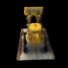

# Tiny_Nerf-3D-Reconstruction

Neural Radiance Field is a fully connected neural network that creates a novel view of complex 3D scenes based on partial 2D images. NeRF represents scenes as neural radiance fields. Here we use MLP to map spatial location and viewing direction to get output color and output density instead of the occupancy. So the conditioning on view direction allows for modeling view-dependent effects.
